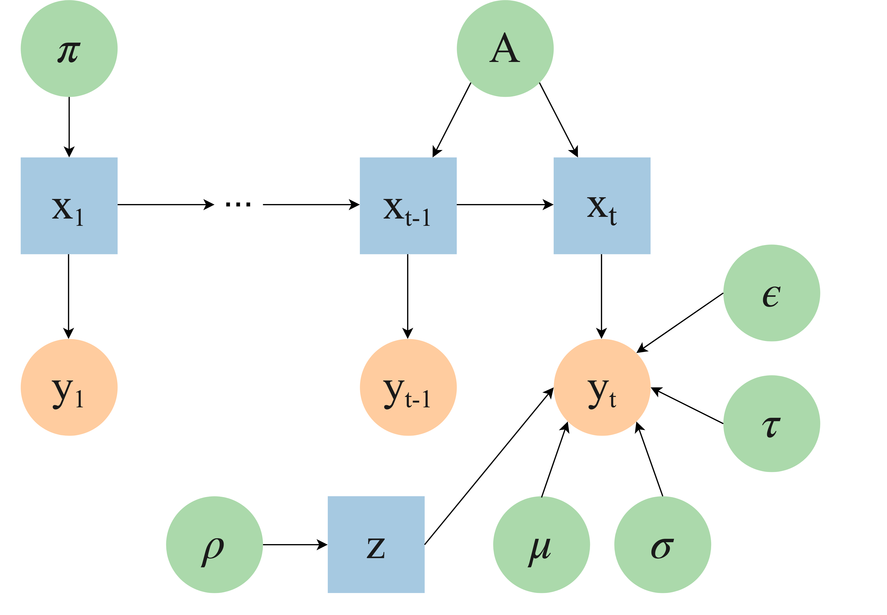

# FeatureSaliency Hidden Markov Model

This repository presents an implementation of the feature saliency HMM algorithm as proposed by Adams et. al in the paper [Feature Selection for Hidden Markov Models and Hidden Semi-Markov Models](https://ieeexplore.ieee.org/document/7450620). The implementation is a modification of the GaussianHMM class of [hmmlearn](https://hmmlearn.readthedocs.io/).

<p align="center">
  
</p>

### Requirements:

Install dependencies via pip install -r requirements.txt

```bash
hmmlearn==0.2.0
scikit-learn==0.19.1
```

### Quick Start:
The notebook FSHMM_example.ipynb has a short example on how to use the library and shows a simple test case.

### Resources:

* [Feature Selection for Hidden Markov Models and Hidden Semi-Markov Models](https://ieeexplore.ieee.org/document/7450620): Original paper where FSHMM is presented. 
* [A novel dynamic asset allocation system using Feature Saliency Hidden Markov models for smart beta investing](https://arxiv.org/abs/1902.10849): Paper that uses FSHMM for regime identification in financial markets. 
* [hmmlearn](https://hmmlearn.readthedocs.io/): python library for HMMs.
* [Simultaneous Feature Selection and Parameter Estimation for Hidden Markov Models](https://libraetd.lib.virginia.edu/public_view/x059c7639): PhD thesis with detailed derivation of the algorithm.


If you use this code, please cite the following papers:

```latex
@article{fons2021,
	title = {A novel dynamic asset allocation system using Feature Saliency Hidden Markov models for smart beta investing},
	author = {Elizabeth Fons and Paula Dawson and Jeffrey Yau and Xiao-jun Zeng and John Keane},
	journal = {Expert Systems with Applications},
	volume = {163},
	year = {2021},
	pages = {113720},
	issn = {0957-4174},
	doi = {10.1016/j.eswa.2020.113720}
}
```

```latex
@article{adams2016,  
	title={Feature Selection for Hidden Markov Models and Hidden Semi-Markov Models},   
	author={Stephen Adams and Peter A. Beling and Randy Cogill},  
	journal={IEEE Access},   
	volume={4},  
	year={2016},  
	pages={1642-1657},  
	doi={10.1109/ACCESS.2016.2552478}
}
```

